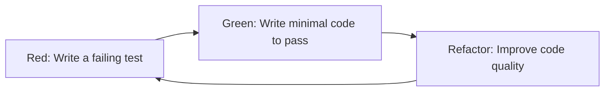

---
title: Advanced Programming Techniques (KST/NNPTP)
description: Complete course materials for advanced object-oriented programming
template: doc
---

import { Tabs, TabItem } from '@astrojs/starlight/components';

# Advanced Programming Techniques (KST/NNPTP)

Welcome to the Advanced Programming Techniques course! This documentation contains all lecture materials, exercises, assignment guidelines, and exam preparation resources in one comprehensive file.

---

## 📑 Table of Contents

### Course Overview
- [Course Objectives](#course-objectives)
- [Assessment & Credit Requirements](#assessment--credit-requirements)
- [Examination Structure](#examination-structure)
- [Schedule](#schedule)

### Lecture Materials (Weeks 1-13)
1. [Clean Code](#week-1-clean-code)
2. [Design Patterns](#week-2-design-patterns)
3. [Refactoring](#week-3-refactoring)
4. [Testing](#week-4-testing)
5. [Test-Driven Development](#week-5-test-driven-development)
6. [Git Fundamentals](#week-6-git-fundamentals)
7. [CI/CD & Git Hooks](#week-7-cicd--git-hooks)
8. [Coding Kata](#week-8-coding-kata)
9. [Dependency Injection & IoC](#week-9-dependency-injection--ioc)
10. [Garbage Collection](#week-10-garbage-collection)
11. [Concurrency & Asynchrony](#week-11-concurrency--asynchrony)
12. [Generics](#week-12-generics)
13. [Functional Programming](#week-13-functional-programming)

### Assignments & Exam
- [Assignment Requirements](#assignment-requirements)
- [Code Review Guide](#code-review-guide)
- [Exam Preparation](#exam-preparation)

---

## Course Overview

### Course Objectives

<span class="badge">Core</span> <span class="badge info">Advanced</span>

Familiarize students with advanced programming techniques in object-oriented languages, including:

- **Clean Code** - Writing maintainable, readable code
- **Design Patterns** - Gang of Four patterns (creational, structural, behavioral)
- **Refactoring** - Improving code structure using IDE tools
- **Testing** - Unit/integration testing with test doubles
- **TDD** - Test-driven development cycle
- **Git** - Distributed version control and team collaboration
- **CI/CD** - Continuous integration and delivery practices
- **DI/IoC** - Dependency injection and inversion of control
- **GC** - Garbage collection algorithms
- **Concurrency** - Parallel and asynchronous programming
- **Generics** - Type erasure vs reification
- **Functional Programming** - FP elements in OO languages

### Assessment & Credit Requirements

<div class="exercise-box">

<strong>📋 To receive credit, students must:</strong>

1. Create **at least 3 patches** for assigned projects
2. Each patch must improve:
   - **Clean code** (refactoring, naming, simplification)
   - **Unit tests** (adding tests, improving coverage)
   - **Language conventions** (following coding standards)
3. Each patch must **pass code review approval**

</div>

### Examination Structure

#### In-Person Format
1. **Code Review** - Written comments on given code examples
2. **Oral Consultation** - Discuss your review with examiner

#### Distance Format
1. **Oral Examination** including:
   - Theoretical questions
   - Practical (programming) tasks
   - Practical application of code review

#### Passing Criteria
- **Minimum 60%** of expected deficiencies must be identified
- Grade E requires identifying 60%+ of code issues

### Schedule

**Distance Learning:** MS Teams environment during standard timetabled hours

| Week | Lecture Topic | Exercise Focus |
|------|---------------|----------------|
| 1 | Clean Code | Code review exercises |
| 2 | Design Patterns | Pattern implementation |
| 3 | Refactoring | IDE refactoring tools |
| 4 | Testing | Writing unit tests |
| 5 | TDD | Red-Green-Refactor cycle |
| 6 | Git Fundamentals | Branching & merging |
| 7 | CI/CD & Git Hooks | Pipeline setup |
| 8 | Coding Kata | Pair programming |
| 9 | DI & IoC | Container configuration |
| 10 | Garbage Collection | GC analysis |
| 11 | Concurrency | Thread management |
| 12 | Generics | Generic programming |
| 13 | Functional Programming | Lambda expressions |

---

## Week 1: Clean Code

### Key Principles

#### 1. Meaningful Names

- Use **intention-revealing** names
- Avoid disinformation (e.g., `accountList` when not a `List`)
- Make meaningful distinctions
- Use pronounceable, searchable names

#### 2. Functions

- Should be **small** and do **one thing**
- Use descriptive names
- Have **minimal arguments** (0-2 preferred)
- Avoid side effects

#### 3. Comments

<span class="badge">Good</span> Legal information, clarification, warnings

<span class="badge danger">Bad</span> Redundant, misleading, noisy comments

> **Rule:** Don't comment bad code—rewrite it!

### Exercise: Refactoring Practice

<div class="exercise-box">

<strong>🎯 Task:</strong> Refactor the following code using clean code principles:

```java
public class A {
    public void doStuff(int x, int y) {
        int z = x + y;
        // do calculation
        System.out.println(z);
    }
}
```

**Hint:** Apply meaningful naming, function extraction, and remove unnecessary comments.

</div>

### Code Smells to Avoid

- **Long methods** (> 10-15 lines)
- **Large classes** (> 200 lines)
- **Deep nesting** (> 3 levels)
- **Magic numbers/strings**
- **Duplicate code**

---

## Week 2: Design Patterns

### Creational Patterns

| Pattern | Purpose | Example Use |
|---------|---------|-------------|
| **Singleton** | Single instance | Configuration manager |
| **Factory** | Object creation | UI component creation |
| **Builder** | Complex object construction | Query builders |

### Structural Patterns

| Pattern | Purpose | Example Use |
|---------|---------|-------------|
| **Adapter** | Interface compatibility | Legacy system integration |
| **Decorator** | Dynamic behavior addition | Logging, caching |
| **Proxy** | Controlled access | Lazy loading, security |

### Behavioral Patterns

| Pattern | Purpose | Example Use |
|---------|---------|-------------|
| **Observer** | Event notification | Event listeners |
| **Strategy** | Algorithm selection | Validation strategies |
| **Command** | Request encapsulation | Undo/redo operations |

### Exercise: Pattern Implementation

<div class="exercise-box">

<strong>🎯 Task:</strong> Implement the Observer pattern for a weather station notification system.

```java
// Define Subject and Observer interfaces
// Create WeatherData class (Subject)
// Create Display classes (Observers)
// Implement notify/update methods
```

</div>

---

## Week 3: Refactoring

### Refactoring Techniques

#### Common Refactorings

1. **Extract Method** - Break large methods into smaller ones
2. **Rename** - Improve names of variables, methods, classes
3. **Move Method** - Move method to more appropriate class
4. **Extract Class** - Split large classes
5. **Replace Conditional with Polymorphism**

### Using IDE Tools

Modern IDEs provide automated refactoring:

| IDE | Shortcut (Windows/Linux) | Action |
|-----|--------------------------|--------|
| VS Code | `Ctrl+Shift+R` | Rename |
| IntelliJ | `Ctrl+Alt+M` | Extract Method |
| VS Code | `Ctrl+Shift+P` → Refactor | Various refactorings |

### Exercise: Refactoring Session

<div class="exercise-box">

<strong>🎯 Task:</strong> Refactor this code using at least 3 different refactoring techniques:

```java
public class OrderProcessor {
    public void process(Order o) {
        double total = 0;
        for (Item i : o.items) {
            total += i.price * i.quantity;
            if (i.category.equals("electronics")) {
                total += total * 0.1;
            }
        }
        if (total > 100) {
            total -= total * 0.05;
        }
        System.out.println("Total: " + total);
    }
}
```

</div>

---

## Week 4: Testing

### Types of Tests

#### Unit Testing
- Tests individual components in isolation
- Fast execution
- Focus on specific functionality

#### Integration Testing
- Tests interaction between components
- Slower execution
- Verifies system integration

### Test Doubles

| Type | Description | Use Case |
|------|-------------|----------|
| **Mock** | Verified expectations | Behavior verification |
| **Stub** | Pre-programmed responses | State verification |
| **Fake** | Simplified implementation | Testing infrastructure |
| **Spy** | Wrapper recording calls | Observing interactions |
| **Dummy** | Placeholder objects | Filling parameter lists |

### Example: Unit Test

```java
@Test
public void shouldCalculateTotalPrice() {
    // Arrange
    ShoppingCart cart = new ShoppingCart();
    cart.addItem(new Item("Book", 25.0));
    cart.addItem(new Item("Pen", 5.0));
    
    // Act
    double total = cart.calculateTotal();
    
    // Assert
    assertEquals(30.0, total, 0.001);
}
```

### Exercise: Writing Tests

<div class="exercise-box">

<strong>🎯 Task:</strong> Write unit tests for the following class:

```java
public class Calculator {
    public int divide(int a, int b) {
        if (b == 0) throw new IllegalArgumentException("Cannot divide by zero");
        return a / b;
    }
    
    public int factorial(int n) {
        if (n < 0) throw new IllegalArgumentException("Negative input");
        if (n == 0) return 1;
        return n * factorial(n - 1);
    }
}
```

</div>

---

## Week 5: Test-Driven Development

### TDD Cycle



### TDD Principles

1. **Never write production code without a failing test**
2. **Write only enough test code to fail**
3. **Write only enough production code to pass**
4. **Refactor after each green cycle**

### Benefits of TDD

- <span class="badge">✅</span> Improved code quality
- <span class="badge">✅</span> Better design decisions
- <span class="badge">✅</span> Living documentation
- <span class="badge">✅</span> Reduced debugging time
- <span class="badge">✅</span> Safe refactoring

### Exercise: TDD Practice

<div class="exercise-box">

<strong>🎯 Task:</strong> Use TDD to implement a Roman Numeral converter:

```
Requirements:
- Convert integers 1-3999 to Roman numerals
- Convert Roman numerals to integers
- Handle invalid inputs
```

**Process:**
1. Write a test for a simple case (e.g., 1 → "I")
2. Implement minimal code to pass
3. Refactor if needed
4. Add next test case (2 → "II")
5. Repeat with more complex cases

</div>

---

## Week 6: Git Fundamentals

### Git Commands

| Command | Purpose | Example |
|---------|---------|---------|
| `clone` | Copy repository | `git clone https://github.com/user/repo` |
| `pull` | Update from remote | `git pull origin main` |
| `push` | Upload to remote | `git push origin feature-branch` |
| `commit` | Save changes locally | `git commit -m "Fix: Fix bug in login"` |
| `checkout` | Switch branches | `git checkout -b new-feature` |
| `branch` | Manage branches | `git branch -d old-branch` |
| `merge` | Combine branches | `git merge feature-branch` |
| `rebase` | Reapply commits | `git rebase main` |

### Team Collaboration Workflow

1. **Fork** repository (or create branch)
2. **Create feature branch** → `git checkout -b feature/description`
3. **Make changes** → commit with descriptive messages
4. **Push** → `git push origin feature/description`
5. **Create Pull/Merge Request**
6. **Code Review** → address feedback
7. **Merge** after approval

### Exercise: Git Workflow

<div class="exercise-box">

<strong>🎯 Task:</strong> Practice the Git workflow:

1. Create a new repository
2. Add a README file
3. Create a feature branch
4. Add a new file
5. Commit changes
6. Merge back to main branch
7. Push to remote

</div>

---

## Week 7: CI/CD & Git Hooks

### Continuous Integration

CI automatically builds and tests code on each push:

```
Push → Build → Run Tests → Generate Reports → Deploy (if successful)
```

### CI Services

| Service | Type | Key Features |
|---------|------|--------------|
| **GitHub Actions** | Cloud | Integrated with GitHub |
| **GitLab CI** | Cloud/Self-hosted | Built into GitLab |
| **Travis CI** | Cloud | Open source friendly |
| **Circle CI** | Cloud | Fast builds |
| **Jenkins** | Self-hosted | Highly customizable |

### Git Hooks

Git hooks are scripts that run automatically on certain events:

| Hook | Trigger | Common Use |
|------|---------|------------|
| `pre-commit` | Before commit | Run linters, format code |
| `commit-msg` | After commit message | Validate message format |
| `pre-push` | Before push | Run tests |
| `pre-receive` | Server receive | Enforce policies |

### Example: Pre-commit Hook

```bash
#!/bin/sh
# .git/hooks/pre-commit

echo "Running linter..."
npm run lint

if [ $? -ne 0 ]; then
    echo "Linting failed! Commit rejected."
    exit 1
fi

echo "Running tests..."
npm test

if [ $? -ne 0 ]; then
    echo "Tests failed! Commit rejected."
    exit 1
fi
```

### Exercise: CI Pipeline Setup

<div class="exercise-box">

<strong>🎯 Task:</strong> Create a CI pipeline configuration:

```yaml
# .github/workflows/ci.yml
name: CI

on: [push, pull_request]

jobs:
  test:
    runs-on: ubuntu-latest
    steps:
      - uses: actions/checkout@v3
      - name: Setup Node.js
        uses: actions/setup-node@v3
        with:
          node-version: '18'
      - name: Install dependencies
        run: npm install
      - name: Run tests
        run: npm test
      - name: Run linter
        run: npm run lint
```

</div>

---

## Week 8: Coding Kata

### What is a Coding Kata?

A coding kata is a programming exercise designed to improve skill through practice and repetition. Like martial arts katas, they help build muscle memory for common programming patterns.

### Popular Katas

| Kata | Language | Concept |
|------|----------|---------|
| **FizzBuzz** | Any | TDD, loops |
| **Bowling** | Any | Scoring logic |
| **String Calculator** | Any | String parsing |
| **Gilded Rose** | Any | Refactoring |
| **Bank OCR** | Any | Pattern matching |

### Pair Programming Exercise

<div class="exercise-box">

<strong>🎯 Task:</strong> In pairs, complete the following kata:

**Bank OCR Kata**
1. Parse OCR input strings representing account numbers
2. Convert to numeric values
3. Validate using checksum

**Roles (rotate every 15 min):**
- **Driver**: Writes code
- **Navigator**: Reviews, thinks ahead

```python
# Example input:
#    _  _     _  _  _  _  _ 
#  | _| _||_||_ |_   ||_||_|
#  ||_  _|  | _||_|  ||_| _|
# 
# Expected output: 123456789
```

</div>

---

## Week 9: Dependency Injection & IoC

### Inversion of Control (IoC)

IoC is a principle where the control of object creation and lifecycle is inverted from the calling code to a container.

### Dependency Injection Methods

| Method | Description | Example |
|--------|-------------|---------|
| **Constructor Injection** | Dependencies passed via constructor | `public class Service { public Service(Repository repo) {...}}` |
| **Setter Injection** | Dependencies set via methods | `service.setRepository(repo);` |
| **Method Injection** | Dependencies passed to methods | `public void save(Repository repo) {...}` |

### DI/IoC Containers

| Container | Language | Features |
|-----------|----------|----------|
| **Spring** | Java | Full-featured |
| **Guice** | Java | Lightweight |
| **Unity** | C# | Microsoft |
| **Autofac** | C# | .NET |
| **NestJS** | TypeScript | Angular-like |

### Example: Spring DI

```java
@RestController
public class UserController {
    @Autowired
    private UserService userService;
    
    @GetMapping("/users/{id}")
    public User getUser(@PathVariable Long id) {
        return userService.findUser(id);
    }
}

@Service
public class UserService {
    @Autowired
    private UserRepository userRepository;
    
    public User findUser(Long id) {
        return userRepository.findById(id);
    }
}
```

### Exercise: DI Implementation

<div class="exercise-box">

<strong>🎯 Task:</strong> Refactor this code to use Dependency Injection:

```java
public class PaymentProcessor {
    private EmailService email = new EmailService();
    private Logger logger = new Logger();
    private Database db = new Database();
    
    public void processPayment(double amount) {
        db.save(amount);
        email.send("Payment processed");
        logger.log("Payment: " + amount);
    }
}
```

**Requirements:**
1. Create interfaces for dependencies
2. Use constructor injection
3. Configure using your chosen DI container

</div>

---

## Week 10: Garbage Collection

### GC Algorithms

#### Reference Counting
- **How it works:** Count references to each object
- **When:** Increment on new reference, decrement on removal
- **Collect:** Object with count 0
- **Pros:** Simple, real-time
- **Cons:** Circular references can leak

#### Mark & Sweep
- **Mark Phase:** Traverse object graph, mark reachable objects
- **Sweep Phase:** Remove unmarked objects
- **Pros:** Handles circular references
- **Cons:** Pauses application

#### Mark & Sweep & Compact
- **Mark:** Identify reachable objects
- **Sweep:** Remove unreachable
- **Compact:** Move live objects to remove fragmentation
- **Pros:** No fragmentation
- **Cons:** More overhead

#### Generational GC
- **Young Generation:** New objects (collected frequently)
- **Old Generation:** Long-lived objects (collected less)
- **Pros:** Optimized performance
- **Cons:** More complex

### Exercise: GC Analysis

<div class="exercise-box">

<strong>🎯 Task:</strong> Analyze this code for memory leaks:

```java
public class CacheManager {
    private static final Map<String, Object> cache = new HashMap<>();
    
    public void addToCache(String key, Object value) {
        cache.put(key, value);
    }
    
    public Object getFromCache(String key) {
        return cache.get(key);
    }
}
```

**Questions:**
1. What causes memory leaks?
2. How would you fix it?
3. Which GC algorithm would handle this best?

</div>

---

## Week 11: Concurrency & Asynchrony

### Thread Management

#### Thread Creation

```java
// Extend Thread
class Worker extends Thread {
    public void run() {
        System.out.println("Working...");
    }
}

// Implement Runnable
class Task implements Runnable {
    public void run() {
        System.out.println("Task executing...");
    }
}

// Using thread pool
ExecutorService executor = Executors.newFixedThreadPool(10);
executor.submit(() -> {
    System.out.println("Task in thread pool");
});
```

#### Thread Pools

| Pool Type | Description | Use Case |
|-----------|-------------|----------|
| **Fixed** | Fixed number of threads | CPU-bound tasks |
| **Cached** | Grows as needed | Many short tasks |
| **Single** | Single thread | Sequential processing |

### Asynchronous Programming Patterns

#### JavaScript/TypeScript
```javascript
// Callback
fs.readFile('file.txt', (err, data) => {
    if (err) throw err;
    console.log(data);
});

// Promise
fetch('api/data')
    .then(response => response.json())
    .then(data => console.log(data));

// Async/Await
async function getData() {
    const response = await fetch('api/data');
    const data = await response.json();
    console.log(data);
}
```

#### C# Async/Await
```csharp
public async Task<string> GetDataAsync() {
    var result = await httpClient.GetStringAsync("api/data");
    return result;
}
```

### Exercise: Concurrency Practice

<div class="exercise-box">

<strong>🎯 Task:</strong> Implement concurrent processing:

```java
// Process a list of URLs concurrently
// Use a thread pool
// Handle errors gracefully
// Collect and return results

public class ConcurrentProcessor {
    public List<String> processUrls(List<String> urls) {
        // Implement this method
        // Use ExecutorService
        // Return results in order
        // Handle timeouts
    }
}
```

</div>

---

## Week 12: Generics

### Type Erasure (Java)

Java uses **type erasure** - generic type information is removed at compile time.

```java
// Java code with generics
List<String> strings = new ArrayList<>();
strings.add("Hello");
String s = strings.get(0); // Cast inserted by compiler

// After type erasure (what JVM sees)
List strings = new ArrayList();
strings.add("Hello");
String s = (String) strings.get(0); // Explicit cast added
```

#### Java Generics Limitations
- <span class="badge danger">✗</span> Cannot use primitive types (int → Integer)
- <span class="badge danger">✗</span> Cannot create generic arrays
- <span class="badge danger">✗</span> Cannot use `instanceof` with generics
- <span class="badge danger">✗</span> Cannot have static generic fields

### Reification (C#)

C# uses **reification** - generic type information is preserved at runtime.

```csharp
// C# code with generics
List<string> strings = new List<string>();
strings.Add("Hello");
string s = strings[0]; // No cast needed

// Runtime type information preserved
Console.WriteLine(typeof(List<string>)); // System.Collections.Generic.List`1[System.String]
```

#### C# Generics Advantages
- <span class="badge">✅</span> Can use value types without boxing
- <span class="badge">✅</span> Type information available at runtime
- <span class="badge">✅</span> Better performance
- <span class="badge">✅</span> Can check types at runtime

### Exercise: Generic Implementation

<div class="exercise-box">

<strong>🎯 Task:</strong> Implement a generic repository:

```java
// Java version (type erasure)
public interface Repository<T> {
    T findById(Long id);
    List<T> findAll();
    void save(T entity);
    void delete(T entity);
}

// C# version (reification)
public interface IRepository<T> {
    T FindById(long id);
    List<T> FindAll();
    void Save(T entity);
    void Delete(T entity);
}
```

**Implementation requirements:**
1. Generic CRUD operations
2. Works with any entity type
3. Include type-safe ID handling
4. Demonstrate both Java and C# versions

</div>

---

## Week 13: Functional Programming

### FP Elements in OO Languages

#### Lambda Expressions

```java
// Java - Lambda expression
List<String> names = Arrays.asList("Alice", "Bob", "Charlie");
names.stream()
    .filter(name -> name.startsWith("A"))
    .map(String::toUpperCase)
    .forEach(System.out::println);

// C# - Lambda expression
List<string> names = new List<string> { "Alice", "Bob", "Charlie" };
var result = names
    .Where(name => name.StartsWith("A"))
    .Select(name => name.ToUpper())
    .ToList();
```

#### LINQ (C#)
```csharp
var query = from name in names
            where name.StartsWith("A")
            select name.ToUpper();

var query2 = names
    .Where(n => n.Length > 3)
    .OrderBy(n => n)
    .Select(n => new { Name = n, Length = n.Length });
```

#### Stream API (Java)
```java
List<Integer> numbers = Arrays.asList(1, 2, 3, 4, 5);

// Chained operations
numbers.stream()
    .filter(n -> n % 2 == 0)     // Filter
    .map(n -> n * 2)             // Transform
    .reduce(0, Integer::sum);    // Reduce

// Collect to new list
List<String> strings = numbers.stream()
    .map(Object::toString)
    .collect(Collectors.toList());
```

### Functional Concepts

| Concept | Description | Example |
|---------|-------------|---------|
| **Pure Functions** | No side effects | `int add(int a, int b) { return a + b; }` |
| **Immutable Objects** | Cannot be modified after creation | `String` in Java |
| **Function Closures** | Functions capturing state | Lambda with captured variables |
| **Higher-order Functions** | Functions as parameters | `forEach`, `map`, `filter` |

### Exercise: Functional Programming

<div class="exercise-box">

<strong>🎯 Task:</strong> Rewrite this code using functional programming:

```java
// Imperative version
List<String> result = new ArrayList<>();
for (Person p : people) {
    if (p.getAge() > 18) {
        String name = p.getName().toUpperCase();
        result.add(name);
    }
}
Collections.sort(result);
```

**Requirements:**
1. Use streams/collections
2. Use lambda expressions
3. Chain operations
4. Avoid explicit loops

</div>

---

## Assignment Requirements

### Patch Requirements

<div class="exercise-box">

<strong>📋 To receive credit, create at least 3 patches:</strong>

| Patch | Requirement | Example |
|-------|-------------|---------|
| **Patch 1** | Clean code improvement | Refactoring, naming, simplification |
| **Patch 2** | Unit tests | Adding tests, improving coverage |
| **Patch 3** | Language conventions | Following coding standards |

</div>

### Code Review Process

1. **Submit Patch** → Create pull/merge request
2. **Code Review** → Peer/instructor review
3. **Address Comments** → Make requested changes
4. **Approval** → Passes code review

### Submission Checklist

<div class="checklist">

- [ ] Code compiles without errors
- [ ] All existing tests pass
- [ ] New tests are included
- [ ] Code follows project conventions
- [ ] Commit messages are clear
- [ ] Patch is focused (one feature/fix per patch)

</div>

---

## Code Review Guide

### What to Look For

#### 1. Correctness
- Does it solve the problem?
- Are edge cases handled?
- Are there security concerns?

#### 2. Readability
- Is it easy to understand?
- Are names meaningful?
- Is complexity manageable?

#### 3. Performance
- Are there performance issues?
- Can it be optimized?
- Are resources properly managed?

#### 4. Testing
- Is the code properly tested?
- Are tests comprehensive?
- Do tests cover edge cases?

#### 5. Design
- Does it follow good design principles?
- Is it maintainable?
- Are patterns used appropriately?

### Code Review Example

<div class="review-note">

<strong>🔍 Practice Review:</strong> Identify issues in this code:

```java
public class DataProcessor {
    public void process(String data) {
        // process data
        if (data == null) {
            // handle null
        }
        // do something with data
    }
}
```

**Issues to identify:**
1. Null handling is incomplete
2. Vague method name
3. Missing exception handling
4. No return value/indicator
5. Unclear what "process" does
6. Missing logging

</div>

---

## Exam Preparation

### Exam Structure

#### In-Person Format
1. **Code Review:** Written comments on given code examples
2. **Oral Consultation:** Discuss your review with examiner

#### Distance Format
1. **Oral Examination:**
   - Theoretical questions
   - Practical (programming) tasks
   - Practical application of code review

### Passing Criteria

**Minimum 60%** of expected deficiencies must be identified in the code review.

### Key Topics to Review

| Week | Topic | Key Concepts |
|------|-------|--------------|
| 1 | Clean Code | Naming, comments, functions |
| 2 | Design Patterns | Creational, structural, behavioral |
| 3 | Refactoring | Techniques, IDE tools |
| 4 | Testing | Unit tests, test doubles |
| 5 | TDD | Red-Green-Refactor cycle |
| 6 | Git | Commands, workflows |
| 7 | CI/CD | Pipelines, hooks |
| 8 | Coding Kata | Practice exercises |
| 9 | DI & IoC | Injection methods, containers |
| 10 | GC | Algorithms, memory management |
| 11 | Concurrency | Threads, async patterns |
| 12 | Generics | Type erasure, reification |
| 13 | Functional | Lambdas, streams, LINQ |

### Practice Questions

<div class="exercise-box">

<strong>📝 Sample Exam Questions:</strong>

1. **Clean Code:** What's wrong with this code? How would you fix it?
2. **Design Patterns:** When would you use Observer vs Mediator?
3. **Testing:** What's the difference between a mock and a stub?
4. **Git:** What's the difference between merge and rebase?
5. **Generics:** Explain type erasure vs reification.

</div>

### Resources

- All lecture slides available in MS Teams
- Coding kata exercises
- Sample code repositories
- MS Teams recordings
- Practice code review examples
- Textbook: Clean Code by Robert C. Martin

---

## Quick Reference Cards

### Git Commands

```bash
# Basic workflow
git clone <url>
git checkout -b feature-branch
git add .
git commit -m "description"
git push origin feature-branch

# Update
git pull origin main
git rebase main

# Branch management
git branch -d branch-name
git merge feature-branch
```

### Test Annotations

| Java | C# | Purpose |
|------|-----|---------|
| `@Test` | `[Test]` | Test method |
| `@BeforeEach` | `[SetUp]` | Setup before each test |
| `@AfterEach` | `[TearDown]` | Cleanup after each test |
| `@BeforeAll` | `[OneTimeSetUp]` | Setup once |
| `@Disabled` | `[Ignore]` | Skip test |

### Design Patterns Quick Reference

| Pattern | Type | Intent |
|---------|------|--------|
| Singleton | Creational | Ensure single instance |
| Factory | Creational | Create objects without exposing logic |
| Builder | Creational | Construct complex objects step by step |
| Adapter | Structural | Convert interface to another interface |
| Decorator | Structural | Add responsibilities dynamically |
| Observer | Behavioral | Define one-to-many dependency |
| Strategy | Behavioral | Define family of algorithms |
| Command | Behavioral | Encapsulate request as object |

---

*End of Course Documentation*

**Last Updated:** 2026-08-28
**Course Code:** KST/NNPTP
**Instructor:** [Your Name]
**MS Teams Channel:** [Link]
**Repository:** [GitHub Link]
```