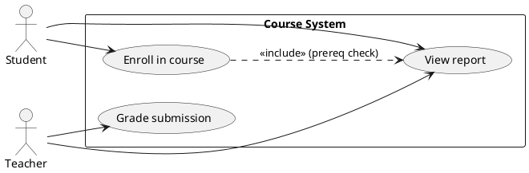
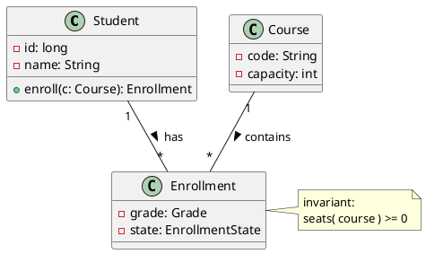
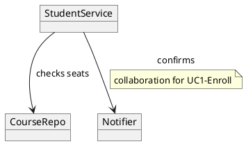
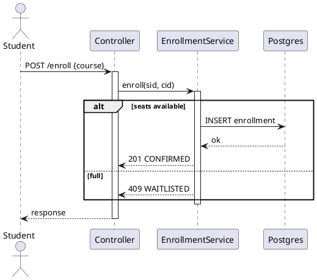
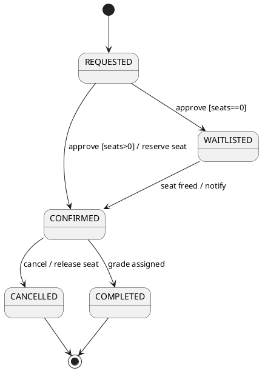
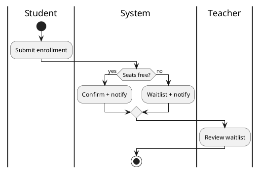
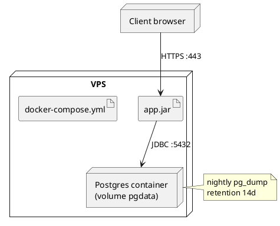

import { Tabs, TabItem } from '@astrojs/starlight/components';

# Year's Project (KST/NNPRO)

Welcome to the Year's Project! This guide walks your team from project assignment through iterative development — requirements and use cases, static and dynamic UML modelling, deployment, documentation, and final presentation — with checklists and PlantUML snippets for every phase.

---

## 📑 Table of Contents

### Course Overview
- [Course Objectives](#course-objectives)
- [Assessment & Credit Requirements](#assessment--credit-requirements)
- [Examination Structure](#examination-structure)
- [Schedule](#schedule)

### Lecture Materials (Weeks 1-13)
1. [Week 1: Project Assignment and Team Setup](#week-1-project-assignment-and-team-setup)
2. [Week 2: Iterative Lifecycle and Project Governance](#week-2-iterative-lifecycle-and-project-governance)
3. [Week 3: Requirements and Use Case Diagrams](#week-3-requirements-and-use-case-diagrams)
4. [Week 4: Client Feedback I](#week-4-client-feedback-i)
5. [Week 5: Static Structure - Class Diagrams](#week-5-static-structure--class-diagrams)
6. [Week 6: System Dynamics - Collaboration](#week-6-system-dynamics--collaboration)
7. [Week 7: Sequence and Collaboration Diagrams](#week-7-sequence-and-collaboration-diagrams)
8. [Week 8: State Models - Object Behaviour](#week-8-state-models--object-behaviour)
9. [Week 9: Process Modelling - Activity Diagrams](#week-9-process-modelling--activity-diagrams)
10. [Week 10: Client Feedback II](#week-10-client-feedback-ii)
11. [Week 11: Deployment - Component and Deployment Diagrams](#week-11-deployment--component-and-deployment-diagrams)
12. [Week 12: System Documentation](#week-12-system-documentation)
13. [Week 13: Final Presentation](#week-13-final-presentation)

### Assignments & Exam
- [Assignment Requirements](#assignment-requirements)
- [Code Review Guide](#code-review-guide)
- [Exam Preparation](#exam-preparation)
- [Quick Reference Cards](#quick-reference-cards)

---

## Course Overview

### Course Objectives

<span class="badge">Core</span> <span class="badge info">Team project</span>

Student teams will deliver a working software system end-to-end:

- **Teamwork** - roles, task split, communication, version control discipline
- **Iterative lifecycle** - inception → elaboration → construction → transition with feedback loops
- **Requirements** - elicitation, use cases, acceptance criteria, client feedback
- **UML modelling** - class, collaboration/sequence, state, activity, component, deployment diagrams
- **Delivery** - implementation, testing, deployment, documentation, presentation

### Assessment & Credit Requirements

<div class="exercise-box">

<strong>📋 To receive credit (Zk+), the team must:</strong>

1. Deliver a **working system** through staged milestones (proposal → architecture/DB → implementation → testing/docs/presentation)
2. Produce **UML documentation** (use case, class, sequence/collaboration, state, activity, component, deployment)
3. Incorporate **two client feedback rounds** (weeks 4 and 10) with recorded change log
4. Pass **final presentation + individual defence** (each member explains their contribution)

</div>

### Examination Structure

1. **Artefact review** - requirements, models, code, tests, docs (completeness + consistency)
2. **Live demo** - happy path + one failure/edge case
3. **Individual defence** - role, decisions, trade-offs; 60%+ to pass

### Schedule

| Week | Phase | Focus |
|------|-------|-------|
| 1 | Assignment, teams, task split | Charter, repo, roles |
| 2 | Iterative lifecycle, governance | Iteration plan, DoD |
| 3 | Requirements + use cases | Elicitation, UC diagrams |
| 4 | Feedback I | Prototype review, backlog update |
| 5 | Static design | Class diagrams |
| 6 | Dynamics | Collaboration design |
| 7 | Sequence/collaboration | Interaction detail |
| 8 | State model | Object lifecycles |
| 9 | Activity | Business processes |
| 10 | Feedback II | Beta review, scope triage |
| 11 | Deployment | Component + deployment diagrams |
| 12 | Documentation | User + technical docs |
| 13 | Presentation | Demo + defence |

---

## Week 1: Project Assignment and Team Setup

The assigned software project starts with people and plumbing: team roles, task split, repo, and working agreements.

### Key Concepts

- **Roles** - PM/coordinator, analyst, architect, developers, tester, documenter (rotate or specialise — record it)
- **Task split** - WBS → issues with owners + due dates; nobody owns "everything"
- **Working agreements** - branching (trunk/feature), commit style (Conventional Commits), meeting cadence, Definition of Done

| Artefact | Contains |
|----------|----------|
| Team charter | Members, roles, contacts, cadence, tools |
| Repo scaffold | README, LICENSE, `.gitignore`, CI skeleton |
| Backlog v0 | Epics → stories with acceptance criteria |

```bash
# Week 1 scaffold
mkdir nnpro && cd nnpro && git init -b main
cat > README.md <<'EOF'
# NNPRO Project
Vision (1 paragraph) | Team & roles | Links (board, board, docs)
## Run
docker compose up --build
## DoD
Reviewed + tested + documented + demoed
EOF
git add -A && git commit -m "chore: scaffold project"
```

### Exercise

<div class="exercise-box">

<strong>🎯 Task:</strong> Charter your team:

1. Fill a RACI for: requirements, architecture, backend, frontend, tests, docs, demo.
2. Create 10 starter issues (epics → stories) with acceptance criteria and owners.
3. Agree branching + commit conventions; protect `main` with required review in your forge.

</div>

---

## Week 2: Iterative Lifecycle and Project Governance

Apply an iterative lifecycle: short timeboxed iterations, each delivering a tested increment plus updated docs/models.

### Lifecycle

| Phase | Goal | Exit |
|-------|------|------|
| Inception | Vision, scope, risks | Approved proposal |
| Elaboration | Architecture + key risks retired | Walking skeleton |
| Construction | Feature increments | Beta |
| Transition | Deployment, docs, handover | Release + presentation |

- **Iteration anatomy** - plan → build → review (demo) → retrospective → replan
- **Governance** - decision log (ADR), risk board (top 5 + mitigations), burndown

```markdown
<!-- ADR-001: stack choice -->
# ADR-001 Use Spring Boot + Postgres
Date: 2026-10-01 | Status: accepted
Context: team knows Java; relational data; ES optional later.
Decision: Boot 3 + Postgres 16 + Docker Compose.
Consequences: needs JPA modelling; gain: hiring-like stack, testcontainers.
```

### Exercise

<div class="exercise-box">

<strong>🎯 Task:</strong> Plan iterations 1-3:

1. Write an iteration plan (goal, stories, demo script, risks) for iteration 1.
2. Record ADR-001 (stack) and ADR-002 (monolith-first vs microservices) with consequences.
3. Define your Definition of Done; show how a story moves TODO→DONE on the board.

</div>

---

## Week 3: Requirements and Use Case Diagrams

Specify what the system must do: actors, goals, functional/non-functional requirements, and use-case diagrams with scenarios.

### Key Concepts

- **Requirements split** - functional (behaviours) vs non-functional (performance, security, usability, constraints). <span class="badge">Good</span> testable ("p95 < 300 ms"); <span class="badge danger">Bad</span> vague ("fast")
- **Use cases** - actor goal, pre/postconditions, main + alternative flows, `<<include>>/<<extend>>`
- **Traceability** - REQ-xxx → UC-xxx → tests; every UC has acceptance criteria



```gherkin
# UC1 scenario (Gherkin acceptance)
Scenario: Enroll with free capacity
  Given course "DBS" has free seats
  When student "novak" enrolls
  Then enrollment is "CONFIRMED" and seats decrease by 1
```

### Exercise

<div class="exercise-box">

<strong>🎯 Task:</strong> Specify 5 use cases:

1. Draw the UC diagram (actors + include/extend where justified).
2. Write main + 2 alternative flows for the riskiest UC in Gherkin.
3. Build a trace matrix REQ→UC→test IDs; flag any orphan requirement.

</div>

---

## Week 4: Client Feedback I

First feedback round with the project client: demo the prototype/walking skeleton, capture verdicts, replan scope.

### Running the Review

- **Demo script** - 10 min happy path on real-looking data; no live-coding fixes
- **Feedback protocol** - each note → accepted / deferred / rejected with reason + owner
- **Scope triage** - MoSCoW (Must/Should/Could/Won't) re-applied after feedback

<div class="checklist">

- [ ] Demo environment reproducible (seed script / compose)
- [ ] Minutes: decisions, not transcription
- [ ] Change log entries linked to backlog issues
- [ ] Updated iteration plan published within 48 h

</div>

```markdown
# Feedback log 2026-10-2x
| # | Note | Verdict | Issue | Owner |
|---|------|---------|-------|-------|
| 1 | Add CSV export to reports | accepted | #42 | Ales |
| 2 | Dark mode | deferred (post-release) | #43 | — |
| 3 | Skip email verification | rejected (security) | — | — |
```

### Exercise

<div class="exercise-box">

<strong>🎯 Task:</strong> Hold feedback I (role-play if no client):

1. Demo a clickable prototype or walking skeleton; record 5+ notes in the log format above.
2. Re-MoSCoW the backlog; move at least one item to Won't with justification.
3. Update the risk board: which risk did the demo retire or reveal?

</div>

---

## Week 5: Static Structure - Class Diagrams

Model the static structure: domain classes, attributes, associations, multiplicities, and key design patterns.

### Key Concepts

- **Abstraction level** - analysis (domain, no tech) → design (types, visibilities, patterns)
- **Relationships** - association, aggregation (◇), composition (◆), inheritance, dependency, multiplicity (`1`, `*`, `0..1`, `1..*`)
- **Design hygiene** - invariants, value objects, repository/service split; avoid anemic-everything or god classes



### Exercise

<div class="exercise-box">

<strong>🎯 Task:</strong> Draw the domain class diagram:

1. 6-10 classes with multiplicities + 2 invariants as notes.
2. Mark one aggregate root with composition; justify the boundary.
3. Map classes to JPA entities: identify `@OneToMany(mappedBy)`, cascade, and fetch choices.

</div>

---

## Week 6: System Dynamics - Collaboration

Design how objects cooperate to realise use cases: responsibilities, collaborations, interfaces before sequence detail.

### Key Concepts

- **CRC cards** - Class / Responsibilities / Collaborators — great workshop tool
- **Collaboration structure** - which objects talk to which; minimise coupling (Law of Demeter, tell-don't-ask)
- **Interface sketch** - service operations derived from UC steps (e.g. `enroll(studentId, courseId)`)

| Class | Responsibilities | Collaborators |
|-------|------------------|---------------|
| EnrollmentService | enforce capacity, create enrollment | StudentRepo, CourseRepo |
| Course | track seats | Enrollment |
| Notifier | send confirmation | MailGateway |



### Exercise

<div class="exercise-box">

<strong>🎯 Task:</strong> CRC workshop for your riskiest UC:

1. Write CRC cards for 4-6 classes; photograph/transcribe into docs.
2. Derive service interfaces (method signatures) from UC steps.
3. Identify one Demeter violation in your draft and refactor it (tell-don't-ask).

</div>

---

## Week 7: Sequence and Collaboration Diagrams

Detail the interactions over time (sequence) and structure (collaboration/communication diagrams) for key scenarios including errors.

### Sequence Essentials

- **Fragments** - `alt` (branches), `opt`, `loop`, `ref`, `par`; activation bars; sync vs async messages
- Show the **sad path**: capacity full, validation failure, timeout — not just happy path



### Exercise

<div class="exercise-box">

<strong>🎯 Task:</strong> Model two flows:

1. Happy-path sequence for your core UC with `alt` for one business rule.
2. Failure sequence (validation/409/timeout) showing error propagation to HTTP status.
3. Peer-review another team's diagram for missing activations or unlabelled returns.

</div>

---

## Week 8: State Models - Object Behaviour

Model lifecycle-driven entities (enrollment, order, ticket) as state machines: states, events, guards, actions.

### Concepts

- **States vs flags** - if `if/else` on status spreads everywhere, you need a state model
- **Notation** - initial/final, transitions `event [guard] / action`, composite + orthogonal regions for complex entities
- **Implementation** - enum + transition table; Spring StateMachine optional



```java
// Transition table sketch
enum EState { REQUESTED, CONFIRMED, WAITLISTED, CANCELLED, COMPLETED }
record Transition(EState from, String event, EState to) {}
```

### Exercise

<div class="exercise-box">

<strong>🎯 Task:</strong> State-model your key entity:

1. Draw the diagram with at least one guard and one action per region.
2. Implement the transition table + a unit test for every transition (incl. illegal-transition rejection).
3. Show where the state diagram forced a code change (e.g. removed boolean flags).

</div>

---

## Week 9: Process Modelling - Activity Diagrams

Model end-to-end business processes across swimlanes (student / system / teacher): control flow, decisions, forks/joins, outputs.

### Concepts

- **Swimlanes/partitions** - who does what; handoffs are where processes break
- **Nodes** - initial/final, action, decision/merge (◇), fork/join (bars), object flows
- Keep activities at **business level** (not line-by-line code)



### Exercise

<div class="exercise-box">

<strong>🎯 Task:</strong> Map your core process:

1. Activity diagram with 2-3 swimlanes, one parallel section (fork/join), and one exception path.
2. Attach process metrics: where would you measure lead time / drop-off?
3. Derive 3 acceptance tests directly from diagram paths (happy + 2 alternates).

</div>

---

## Week 10: Client Feedback II

Second (beta) feedback: feature-complete system on production-like data. Goal: acceptance verdict + release punch list.

### Triage

| Verdict | Meaning | Action |
|---------|---------|--------|
| Accept | Meets criteria | Lock scope, polish |
| Accept with notes | Minor gaps | Punch list with owners/dates |
| Reject item | Fails criteria | Fix iteration or descoped (recorded) |

> **Rule:** No new Must-requirements after feedback II without dropping something else. Protect the release.

```markdown
# Punch list (beta)
- [ ] #71 Export CSV uses semicolons for Excel CZ (@Ales, due Fri)
- [ ] #72 p95 search < 500ms on 10k docs (@Petra, due Fri)
- [ ] #73ather: fix 500 on empty schedule (@Jan, due Wed)
```

### Exercise

<div class="exercise-box">

<strong>🎯 Task:</strong> Run beta review:

1. Demo on production-like data; collect accept/defer/reject per feature.
2. Produce a dated punch list (≤10 items) with owners; re-plan the final iteration.
3. Freeze scope in writing; any new Must needs a signed swap (what drops out).

</div>

---

## Week 11: Deployment - Component and Deployment Diagrams

Show the physical system: deployable components, artifacts, nodes, networks, and data flows.

### Concepts

- **Component diagram** - components + provided/required interfaces (`<<component>>`, `<<artifact>>`, ports)
- **Deployment diagram** - nodes (`<<device>>`, `<<executionEnvironment>>`), artifacts on nodes, communication paths
- Cover: secrets/config, volumes/backups, TLS termination, healthchecks, scaling notes



```yaml
# compose sketch (deployment truth)
services:
  app: { build: ., ports: ["8080:8080"], depends_on: [db] }
  db:  { image: postgres:16, volumes: ["pgdata:/var/lib/postgresql/data"] }
volumes: { pgdata: {} }
```

### Exercise

<div class="exercise-box">

<strong>🎯 Task:</strong> Deliver deployment truth:

1. Component + deployment diagrams matching your actual compose/infra (no fiction).
2. Document secrets strategy (env file/vault — never committed), backup + restore drill.
3. Perform a clean-machine deploy (teammate's laptop/VM) from README alone; fix README gaps found.

</div>

---

## Week 12: System Documentation

Documentation that survives handover: user guide, operator runbook, architecture/tech docs, ADRs.

### Structure

| Doc | Audience | Contains |
|-----|----------|----------|
| README | Everyone | Vision, run, demo, links |
| User guide | End users | Tasks, screenshots, FAQ |
| Runbook | Operators | Deploy, backup/restore, incident steps |
| Tech reference | Developers | Architecture, models, API, schema |
| ADRs | Future team | Decisions + consequences |

```markdown
# Runbook (1 page)
Deploy: docker compose up --build -d
Health: curl /actuator/health ; logs: docker compose logs -f app
Backup: pg_dump ... | Restore: psql < dump.sql (tested 2026-12-01)
Incidents: 500s -> check DB conn, disk, recent deploy (rollback: compose up <prev-tag>)
```

### Exercise

<div class="exercise-box">

<strong>🎯 Task:</strong> Documentation sprint:

1. Write the 1-page runbook; test restore on a scratch volume.
2. Record a 3-minute user walkthrough (or captioned screenshots) for the top 3 tasks.
3. Peer-review docs against code: every config flag/endpoint in docs must exist in code and vice versa.

</div>

---

## Week 13: Presentation

Final presentation: tell the story (problem → solution → demo → lessons), demo reliably, defend individually.

### Format (15-20 min)

1. **Problem & users** (2 min) - who hurts, what changes
2. **Architecture** (3 min) - one diagram, key decisions (ADRs)
3. **Live demo** (7 min) - happy path + one edge case; pre-seeded data, fallback video
4. **Lessons & future** (3 min) - what broke, what you'd change

<div class="checklist">

- [ ] Seeded demo data + reset script
- [ ] Offline fallback (recorded video) if network dies
- [ ] Each member owns ≥1 section + can answer on any part
- [ ] Time-boxed rehearsal (record + trim)

</div>

### Exercise

<div class="exercise-box">

<strong>🎯 Task:</strong> Rehearse:

1. Dry-run with timer; cut to fit. Assign a timekeeper.
2. Prepare 5 likely examiner questions (trade-offs, failures, contributions) with 60-second answers.
3. Record the fallback demo video; verify it plays on the presentation machine.

</div>

---

## Assignment Requirements

### Milestones

<div class="exercise-box">

<strong>📋 Project milestones (team):</strong>

| Milestone | Deliverables |
|-----------|--------------|
| Proposal | Vision, scope, team/roles, iteration plan |
| Architecture + DB | UC + class diagrams, schema, walking skeleton |
| Implementation | Features per iteration, tests, CI green |
| Testing + docs + presentation | Punch list empty, runbook, demo, defence |

</div>

### Submission Checklist

<div class="checklist">

- [ ] Repo builds from clean checkout (`compose up` / `mvn verify`)
- [ ] All UML diagrams present and consistent with code
- [ ] Two feedback logs + change traceability
- [ ] Tests + CI badge green; coverage noted
- [ ] Runbook tested (backup/restore drill dated)
- [ ] Presentation + demo video fallback ready

</div>

---

## Code Review Guide

### What to Look For

#### 1. Team Hygiene
- Small focused commits? PR reviews with checklist? CI gating merges?

#### 2. Model↔Code Consistency
- Class diagram matches entities/services? Sequence matches controller flow? States match status handling?

#### 3. Quality Gates
- Tests for happy + sad paths? Secrets out of repo? Docs updated with code?

### Code Review Example

<div class="review-note">

<strong>🔍 Practice Review:</strong> A PR adds `enroll()` without capacity check or test:

```java
public void enroll(long sid, long cid) {
    repo.save(new Enrollment(sid, cid));  // no seat check, no state, no test
}
```

**Review verdict (request changes):** missing invariant (seats ≥ 0 per Week 5 note); no `alt` failure path (Week 7); no state transition (Week 8); no test; needs capacity guard + 409 mapping + Gherkin test.

</div>

---

## Exam Preparation

### Defence Structure

1. **Team story** - scope, architecture, demo (shared)
2. **Individual slice** - "I owned X; hardest decision was Y because Z; I verified by W"
3. **Questions** - trade-offs, failures, what you'd redo

### Key Topics to Review

| Week | Topic | Key Concepts |
|------|-------|--------------|
| 1 | Teams | RACI, charter, conventions |
| 2 | Lifecycle | Iterations, ADR, DoD |
| 3 | Requirements | UC, Gherkin, traceability |
| 4 | Feedback I | MoSCoW, change log |
| 5 | Classes | Multiplicity, aggregates |
| 6 | Collaboration | CRC, coupling |
| 7 | Sequence | Fragments, sad paths |
| 8 | State | Guards/actions, tables |
| 9 | Activity | Swimlanes, metrics |
| 10 | Feedback II | Punch list, freeze |
| 11 | Deployment | Component/deployment, secrets |
| 12 | Docs | Runbook, guides |
| 13 | Demo | Story, fallback, defence |

### Practice Questions

<div class="exercise-box">

<strong>📝 Sample Defence Questions:</strong>

1. Which requirement changed after feedback, and what did it cost?
2. Show where your sequence diagram and code disagree — then fix one.
3. Why is this entity a state machine rather than status flags?
4. Walk your deployment diagram during a DB outage: what breaks, what recovers?
5. What would you cut first if given one less iteration?

</div>

---

## Quick Reference Cards

### UML Snippets (PlantUML)

```plantuml
' Use case
actor User
rectangle Sys { usecase "Do thing" as UC1 }
User --> UC1

' Class
class A { -id: long } 
A "1" -- "*" B : has >

' Sequence fragment
alt ok
  A -> B : save()
else full
  A --> C : 409
end

' State
[*] --> S1 : start
S1 --> S2 : event [guard] / action

' Activity swimlane
|Role| start : step; stop
```

### Meeting Rites

```bash
git log --oneline --graph -10        # review flow
git commit -m "feat: add waitlist"   # conventional commits
docker compose up --build            # clean demo reset
```

---

*End of Course Documentation*

**Last Updated:** 2026-09-20
**Course Code:** KST/NNPRO
**Credits:** 4 Zk+
